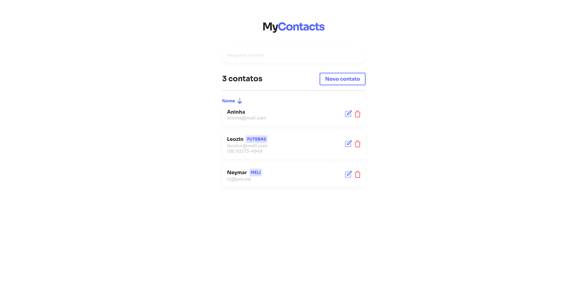
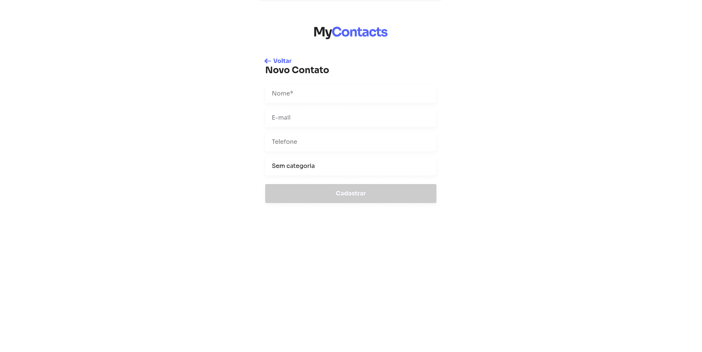
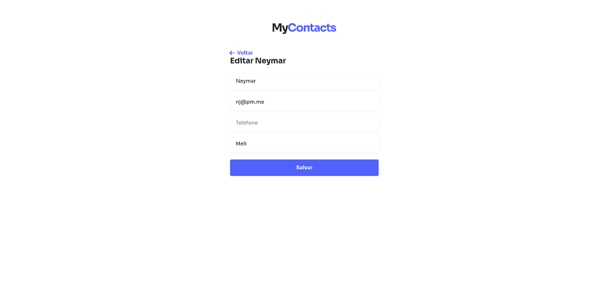

# MyContacts

Este é um projeto para gerenciar contatos, permitindo criar, visualizar, atualizar e excluir contatos, além de organizá-los por categorias. Atualmente, o back-end está concluído e o front-end foi finalizado, mas continuará em constante aprimoramento.

## 🚧 Status do Projeto

⚠️ **Projeto em desenvolvimento contínuo**
- Back-end: ✅ Concluído
- Front-end: ✅ Concluído (em aprimoramento)

## 📋 Funcionalidades

### Funcionalidades Implementadas:
- [x] API RESTful para gerenciar contatos (Node.js + Express)
- [x] CRUD de contatos (criação, leitura, atualização e exclusão)
- [x] Organização de contatos por categorias
- [x] Integração com banco de dados PostgreSQL
- [x] Interface de usuário para gerenciar contatos (React.js)
- [x] Validação de formulários no front-end
- [x] Ordenação de contatos por nome
- [x] Busca por nome de contato
- [x] Feedback visual para ações do usuário (ex.: notificações de sucesso/erro)

### Funcionalidades Futuras:
- [ ] CRUD de categorias (criação, leitura, atualização e exclusão de categorias)
- [ ] Filtro de contatos por categoria no front-end
- [ ] Deploy do projeto (back-end e front-end)
- [ ] Testes automatizados (unitários e de integração)

## 📸 Screenshots

### Tela de Listagem de Contatos

_Descrição: Esta é a tela principal onde os contatos são listados._

### Tela de Criação de Contato

_Descrição: Aqui você pode adicionar novos contatos ao sistema._

### Tela de Edição de Contato

_Descrição: Esta tela permite editar os detalhes de um contato existente._

## 🛠️ Tecnologias Utilizadas

- **Back-end**: Node.js, Express.js
- **Banco de Dados**: PostgreSQL
- **Front-end**: React.js, Styled Components
- **Outras Ferramentas**: Docker, ESLint, Prettier

## 🚀 Como Executar o Projeto

Para executar o projeto, siga os passos abaixo:

### Back-end (API)

1.  Navegue até a pasta `backend`:

    ```bash
    cd backend
    ```
2.  Inicie o Docker Compose para subir o PostgreSQL:

    ```bash
    docker-compose up -d
    ```
3.  Instale as dependências do projeto:

    ```bash
    npm install
    ```
4.  Execute a API em modo de desenvolvimento:

    ```bash
    npm run dev
    ```

### Front-end

1.  Navegue até a pasta `frontend`:

    ```bash
    cd frontend
    ```
2.  Instale as dependências do projeto:

    ```bash
    npm install
    ```
3.  Inicie o servidor de desenvolvimento do React:

    ```bash
    npm start
    ```

Após seguir esses passos, o back-end estará disponível em `http://localhost:3001` e o front-end em `http://localhost:3000` (ou outra porta especificada pelo React).

## 📝 Próximos Passos

- [ ] Implementação de DataMapper

## 📄 Licença

Este projeto está sob a licença MIT. Consulte o arquivo `LICENSE` para mais detalhes.
